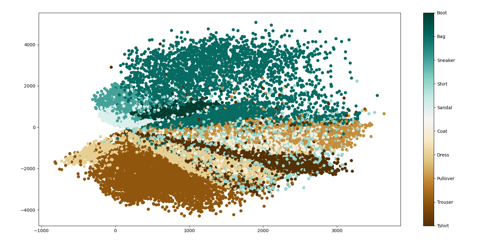
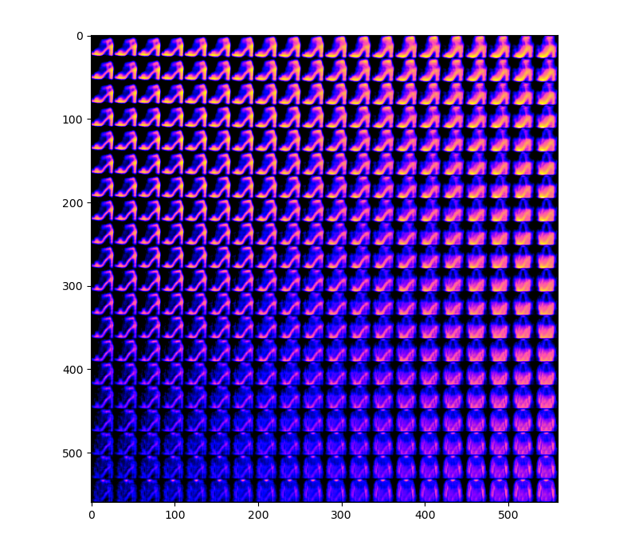

# VAE on FashionMNIST
We implement a simple Variational Auto Encoder trained on the Fashion MNIST dataset. The latent space is chosen to be 2 dimensional to allow for easy plotting.
The details of each file in the repo are given as follows:
* `VAE_fashionmnist.ipynb` - Involves the prototyping, data processing, design and training of our VAE model. The encoder, decoder and total VAE model are saved at the end as `.h5` files.
* `*.h5` files - There are 3 in total, one each for the encoder, decoder and total VAE. These are generated from the Jupyter notebook.
* `visualize_latent.py` - This script was used to plot the encoded sam.ples in the training space. The resulting plot is seen in the next section
* `generate.py` - This script can be used to explore a given area in the latent space to observe the shift and change in different features as the image moves from one style of clothing to another. The resulting plot for our values of a specified area are presented two sections later.

## FashionMNIST Dataset
Fashion-MNIST is a dataset of Zalando's article images—consisting of a training set of 60,000 examples and a test set of 10,000 examples. Each example is a 28x28 grayscale image, associated with a label from 10 classes. The intent was to serve as a direct drop-in replacement for the original MNIST dataset for benchmarking machine learning algorithms. It shares the same image size and structure of training and testing splits. [(excerpt taken directly from original repo)](https://github.com/zalandoresearch/fashion-mnist)

## Theory
According to the abstract in the [original paper](https://arxiv.org/abs/1312.6114),  
>"We introduce a stochastic variational inference and learning algorithm that scales to large datasets and, under some mild differentiability conditions, even works in the intractable case. Our contributions is two-fold. First, we show that a reparameterization of the variational lower bound yields a lower bound estimator that can be straightforwardly optimized using standard stochastic gradient methods. Second, we show that for i.i.d. datasets with continuous latent variables per datapoint, posterior inference can be made especially efficient by fitting an approximate inference model (also called a recognition model) to the intractable posterior using the proposed lower bound estimator."  

The main objective of a classical encoder is to perform dimensionality reduction on a set of data by creating a lower dimensional space such that each dimension in this space can correspond to a feature of the original data. Here, the latent vector (lower dimensional representation) is expected to have enough information so that it can be decoded back to the original image with minimum error.  
In variational auto encoder, the assumption is that there is an underlying probability distribution in the data that can be found. So instead of encoding each sample to a latent vector, the algorithm learns the parameters of the distribution such that the latent vector can be sampled from this learned distribution. These vectors are expected to be successfully decoded into either a sample from the original data or something similar enough. Due to this behaviour, our VAE can be used to generate new data that belongs to the inherent distribution of the training data. This has found to be hugely advantageous especially when dealing with images.

## Visualization of the Latent Space

## Exploration of the Latent Space

We see above how the image transforms from an ankle boot to a bag to a T-shirt, depending on the direction we move in the latent dimension. This is just a small defined area we have chosen, the same can be done for any coordinates in the latent space.  
Ideally, I would have preferred to map the images into a atleast a 3D space to see a more realised change in features when moving in the space, but 2D is easier to plot and more than enough for a simple dataset.

